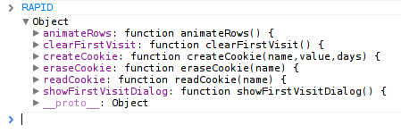

.. include:: <s5defs.txt>

============================================
Rapid Web Prototyping with Lightweight Tools
============================================

:Author:  Andrew Montalenti
:Date:    $Date: 2013-01-27 09:00:00 -0500 (Sun, 27 Jan) $

.. This document is copyright Andrew Montalenti and Parsely, Inc.

.. container:: handout

    **How this was made**

    This document was created using Docutils_/reStructuredText_ and S5_.

    Rapid Web Prototyping with lightweight tools: a tour through "inside
    out" web development with Bootstrap, jQuery, Jinja2, Flask, and
    MongoDB.

.. _Docutils: http://docutils.sourceforge.net/
.. _reStructuredText: http://docutils.sourceforge.net/rst.html
.. _S5: http://meyerweb.com/eric/tools/s5/

Meta Information
----------------

**Me**: I've been using Python for >10 years. I use Python full-time, and have for the last 4 years.

**Startup**: I'm co-founder/CTO of Parse.ly_, a tech startup in the digital media space.

**E-mail me**: andrew@parsely.com

**Follow me on Twitter**: amontalenti_

**Connect on LinkedIn**: http://linkedin.com/in/andrewmontalenti

.. _Parse.ly: http://parsely.com
.. _amontalenti: http://twitter.com/amontalenti

Parse.ly
--------

What do we do?

Requirements
------------

The main requirements for this course are:

* Google Chrome (recent version)
* Python 2.7.x
* Git 1.7/1.8
* virtualenv (described elsewhere)
* basic UNIX shell usage (e.g. bash, zsh)
* basic programming text editor usage (e.g. TextMate/SublimeText, emacs/vim, Komodo)
* a UNIX-like operating system (OS X, Linux VM, or Linux on raw hardware)

Already done with these steps? `Skip ahead!`_

.. _Skip ahead!: #rapid-web-prototyping

Programming Newbies: Beginner Track
-----------------------------------

If you aren't familiar with the command-line, programming text editors, UNIX, and/or don't have a good comfort level with basic usage of Python/Git already, then you can take the "beginner track" in this course.

Rather than setting up your local computer, you will simply follow along what I'm doing on the screen, and optionally connect to a server I have set up where you can experiment with an IPython Notebook and CodeMirror HTML Editor.

You can also download the code to follow along:

http://pixelmonkey.org/pub/rapid-web-code.zip

Is my OS already set up?
------------------------

Open terminal and...

run `python -V` and make sure you're on Python 2.7.x.

run `git --version` to make sure you have git 1.7/1.8 installed.

Python / Git Setup
------------------

A recent Python version (2.7.3) can be installed from `Python.org`_.

A recent Git version (1.8.1) can be downloaded from `git-scm.com`_.

.. _Python.org: http://python.org/download/
.. _git-scm.com: http://git-scm.com/download

UNIX basics
-----------

This course assumes you can walk around the command line a bit.

A quick cheat sheet:

    * ``ls``: list files in current directory
    * ``pwd``: print working directory path
    * ``cd <path>``: change directory
    * ``mkdir <path>``: create a directory
    * ``cat <file>``: show contents of file
    * ``nano <file>``: open file in nano text editor

Repo setup
----------

Make a work area::

    mkdir ~/repos

Clone the code respository::

    git clone git://github.com/amontalenti/rapid-web.git
    cd rapid-web

Inspect the tags::

    git tag -l

Look at `Github web interface`_. Feel free to fork!

.. _Github web interface: https://github.com/amontalenti/rapid-web/

Browse all the additions
------------------------

All the changes from the initial check-in to the last on Github.

https://github.com/amontalenti/rapid-web/compare/v0.2-static...v2.0-fin

virtualenv pre-reqs
-------------------

``easy_install`` command may not be available in some borked Python versions on
Linux and OS X.

Try `easy_install --version` to check.

If not available, use this script::

    curl -O http://python-distribute.org/distribute_setup.py
    python distribute_setup.py

Set up virtualenv
-----------------

Run this virtualenv setup::

    $ sudo easy_install pip
    $ sudo pip install virtualenv

Then::

    $ cd rapid-web
    $ virtualenv rapid-env

This will create a self-contained Python installation for use with this
tutorial.

IPython
-------

One of the first Python development tools I'll use in hour 2 is IPython.

It lets us test code at the command-line easily.

Prototyping code at the command-line is one of the core ways to do effective 
prototyping beyond the HTML / CSS / JavaScript phase.

IPython Setup
-------------

You should now have a virtualenv folder called ``rapid-env``. For convenience,
let's make it easy to activate::

    $ ln -s rapid-env/bin/activate

Activate it with the "magic incantation"::

    $ source activate

And then, install IPython::

    (rapid-env)$ pip install ipython
    ... lots of output ...
    (rapid-env)$ ipython -V
    0.13.1

IPython and Flask installation
------------------------------

Install the requirements with ``pip``::

    $ cat requirements.txt
    ipython
    Flask
    $ pip install -r requirements.txt
    ...

Then, confirm that you can import all the libraries::

    $ ipython
    >>> import flask
    >>> import jinja2
    >>> import werkzeug
    >>> <CTRL+D>
    Do you really want to exit ([y]/n)? y
    $

Advanced Prototyping
--------------------

If you install some optional requirements, you can get:

* IPython Notebook: browser-based Python editor and prototyping environment
* LiveReload: browser plugin and server for auto reloading on page changes

IPython Notebook and LiveReload Installation
--------------------------------------------

These are in ``dev-requirements.txt``, which you can install with ``pip``::

    $ cat dev-requirements.txt
    # for live code updates
    livereload
    # for ipython notebook
    tornado
    pyzmq
    $ pip install -r dev-requirements.txt
    ...
    $ ipython notebook
    <CTRL+C to quit>
    $ livereload -p 8000
    <CTRL+C to quit>

LiveReload Chrome Plugin
------------------------

To actually use LiveReload, you need a browser extension for chrome which can be downloaded here:

https://chrome.google.com/webstore/detail/livereload/jnihajbhpnppcggbcgedagnkighmdlei

SSH Config
----------

We're going to ssh into a remote server in the final hour of the course for
deployment.

To do this, we're going to need to add your public key to the server's list of
"authorized keys".

If you are already a Github user or remotely manage servers with SSH, then you
probably don't need to generate a new public key, but I've included these
instructions here for those of you who don't already have public keys.

Do I have a public key?
-----------------------

Try::

    cat ~/.ssh/id_*.pub

Do you get output like::

    ssh-rsa AAAAB3NzaC1yc2EAAAABIwAAAQE...

If so, you do already have a public key.

SSH Public Key Setup
--------------------

SSH has a small configuration file at ``~/.ssh/config`` that allows you to
specify hostnames that ssh will use.

Upon connecting to a server, ssh looks for an identity file for public key
authentication. This is typically ``~/.ssh/id_rsa``.

This private key has a matching public key, which is typically ``~/.ssh/id_rsa.pub``
and must be listed in the remote host's ``~/.ssh/authorized_keys`` file.

``ssh-keygen`` can create the public/private key for you. Then you need to
share the public key with me.

ssh-keygen
----------

.. sourcecode:: text

    $ ssh-keygen 
    Generating public/private rsa key pair.
    Enter file in which to save the key (/home/user1/.ssh/id_rsa): 
    Your identification has been saved in /home/user1/.ssh/id_rsa.
    Your public key has been saved in /home/user1/.ssh/id_rsa.pub.
    The key fingerprint is:
    43:55:f0:cc:1a:9f:ff:2e:3a:a8:94:8c:f1:62:d3:b1 user1@hacknode
    ...

.ssh/config example
-------------------

Edit the file::

    $ nano ~/.ssh/config

And insert contents::

    Host hacknode
        User shared
        HostName hacknode.alephpoint.com

Then::

    $ ssh hacknode

It'll prompt you for a password right, but that's OK -- just CTRL+C to abort.

No More Preliminaries!
----------------------

On to the main course!

Rapid Web Prototyping
---------------------

Thesis: the most important skill that a modern web developer can have today is
*prototyping*.

Most web developers lack this skill due to a number of biases:

* Computer Science Backend Bias
* Fear of Unskilled Design Bias
* Web Framework SQL Bias
* Polyglot Complexity Bias

Let's take each of these in turn.

Computer Science Backend Bias
-----------------------------

.. class:: incremental

    Myth: The most interesting problems in computing are algorithmic and
    backend systems oriented: e.g. data structures, natural language
    processing, operating systems, distributed systems, cryptography.

    Reality: These are simply the most interesting problems to introverted CS
    PhDs. The most widely used software is not solving fundamental computing
    problems (think Twitter, Facebook, GMail, Reddit) but is instead solving
    user experience problems.

Fear of Unskilled Design Bias
-----------------------------

.. class:: incremental

    Myth: Only a trained graphic designer can create usable and functional user
    interfaces.

    Reality: Anyone can create these interfaces; a skilled designer will
    promote these interfaces from the kind you merely use daily to the kind you
    share excitedly to friends.

Web Framework SQL Bias
----------------------

.. class:: incremental

    Myth: The purpose of a web framework is to unify web technologies with
    backend (database) technologies, specifically a SQL database. Building a
    web app consists of building a SQL model, then building the interfaces on
    that model.

    Reality: SQL isn't necessary in the early stages of a project; it may not
    be necessary at all during the entire lifetime of the project. Traditional
    web frameworks focus on the wrong thing.

Polyglot Complexity Bias
------------------------

.. class:: incremental

    Myth: The web requires knowledge of a slew of complex technologies: a
    backend programming language, a database query language, a templating
    language, JavaScript, HTML, and CSS. That's messy; I prefer to simply code
    in Java, Ruby, Python, etc.

    Reality: This is partially true. The web is messy, but all that's necessary
    to build a web app is some basic knowledge of JavaScript and HTML. Much of
    the rest can be abstracted via modern toolkits like jQuery and Bootstrap.
    You also need a way to render that JavaScript/HTML code, but this isn't as
    tough as it seems.

Beat the Backend Bias Back!
---------------------------

Together, all of these biases form a general software engineering "backend
bias" that I observe in the real world.

The typical Python software engineer has no problem with:

* writing and testing a database schema
* implementing pure Python classes / functions
* thinking about scale and performance
* building a command-line interface

This is a kind of "comfort zone" for typical programmers.

Free From Frontend Fear?
------------------------

Same engineers exhibit a real fear when confronted with:

* creating hand-drawn or digital wireframes
* prototyping entire clickable user interfaces
* experimenting with a user interface concept in isolation
* testing variations of a user interface on a live population

I'm not really concerned with why this split exists, but I definitely observe
it.

Premature Optimization
----------------------

.. class:: incremental

    "Premature optimization is the root of all evil."

    Don't overcomplicate your code with optimizations before you've measured
    whether those optimizations are actually necessary for acceptable runtime
    performance.

    "Premature backend is the root of all evil."

    Don't start to build the backend of your web app until you've determined
    what user experience your application will enable.

Discussion: Is This Fair?
-------------------------

Do you think backends deserve to be built first? I'd like opinions from the
class!

Fake It Till We Make It
-----------------------

Now that you have a sense of the theory behind this course, I'll take you
through three phases of rapid web prototyping:

.. class:: incremental

    * "First Fake": a JavaScript & HTML web clickable with jQuery and Bootstrap

    * "Get Real": introduce Flask & Jinja2, the front-end / back-end split

    * "Ship It!": add a database and deployment, store your first data

Why Fake? (1)
-------------

Traditional software process:

.. class:: incremental

    1. Someone has an idea

    2. Idea elaborated into "Requirements Document"

    3. Requirements enriched with Wireframes (optional, "product lead")

    4. Wireframes enriched into Mockup (optional, "design lead")

    5. Backend engineer builds Requirements into API, database schema, or somesuch

Why Fake? (2)
-------------

.. class:: incremental

    6. Frontend engineer builds Mockup into user interface

    7. Some engineer "wires frontend to backend"

    8. Feature is tested on users

    9. Feedback from users leads to bug reports / revisions / rewrites

Why Fake? (3)
-------------

.. class:: incremental

    Problem: between steps 1 and 9, MONTHS can pass.

    Related problem: when building fundamentally new & innovative products,
    step 9 (feedback from real users) is the most important.

First Fake
----------

.. class:: incremental

    Can we skip from step 1 to step 9?

    Yes: this is the essence of "rapid web prototyping".

    We need to fake a test user into thinking a working system exists.

Light Bulb
----------

.. class:: incremental

    Idea: "Reddit for clickstreams!"

    Reddit is cool, but the explicit "voting" process is annoying.

    People don't mind submitting links, but who wants to take time to upvote/downvote them?

    How about implicit voting based on users clicking on or re-submitting the same article?

    Insight: click is "implicit upvote"; re-submit is "explicit upvote". No
    vote buttons necessary!

Now What?
---------

.. class:: incremental

    Do you start building a database? ``Frontpage``, ``Article``, and ``Link``
    classes w/ ORM bindings? Hell, no!

    Do you start researching high-concurrency web frameworks for your millions of
    potential users? Screw that!

    Do you write a really detailed requirements document and complicated technical
    architecture? What good will that do!?

    Let's **prototype** this idea.

Pen and Paper
-------------

Even before diving into code, let's think about how to sketch out this idea
using the old pen and paper.

Quick discussion about wireframes:

.. class:: incremental

    * hand-drawn vs digital

    * low-fidelity vs high-fidelity

    * information, heirarchy, flow

Goal of Sketch
--------------

Answer key questions:

.. class:: incremental

    * what does she see?

    * what can she do?
      
    * why does she care?

Wireframe share session
-----------------------

You have 5 minutes. Then we'll share!

Wireframe to Static
--------------------

In my version of this wireframe, I have three main screens:

.. class:: incremental

    * Links: shows recently posted articles that are most popular
    
    * Submit: form for submitting a new article to the site
    
    * Search: variation of links screen that lets you find links by keyword

Static HTML
-----------

.. sourcecode:: html

    <!DOCTYPE html>
    <html>
        <head>
            <meta charset="utf-8">
            <title>Rapid News Static</title>

            <link rel="stylesheet" href="css/main.css">
        </head>
        <body>

            

                <!-- fun stuff -->
            

            
        </body>
    </html>

HTML for Prototypers
--------------------

An HTML document is like a little "envelope for your site."

In ``<head>``, you describe the document itself. The ``<title>`` of the document,
some metadata about the document, and links to relevant to stylesheets (CSS).

In the ``<body>``, you put the "main entree": the content itself, or the site structural
elements.

At the bottom of the ``<body>``, you install ``
            
            
        </body>
    </html>

Why Bootstrap?
--------------

.. class:: incremental

    * We are not designers

    * HTML's default styling is ugly!

    * Modern HTML & CSS involves a lot of "boilerplate"

    * CSS is especially tricky for novices to get right

    * Component toolkit built mostly with pre-canned CSS classes

Bootstrap Components
--------------------

* Scaffolding
* Base CSS
* Components
* JavaScript plugins

Scaffolding
-----------

Smooths out the differences between different browser default HTML / CSS styling.

Provides a "grid" and "layout" system.

Supports responsive design approaches (auto scale down for mobile/tablet).

Base CSS
--------

Improves typically-used HTML elements with some reasoanble default stylings.

* ``h1`` through ``h6``
* ``body`` and ``p``
* ``table``
* ``form`` and ``input``
* ``button`` (with links)
* ``img``
* glyphicons

Components
----------

Adds other commonly-used UI components that are "missing" from HTML.

* dropdowns
* navigation bars
* pagination bars
* labels
* alerts
* "media objects"

JavaScript plugins
------------------

Richer interactive components that require JavaScript.

* modal windows
* typeahead search
* image carousels
* tab panels
* tooltips & popovers

Let's build the fake!
---------------------

We'll start with the navigation area and header.

We'll then add a simple listing of fake links in a table.

Navigation Area
---------------

.. sourcecode:: html

    

        

            <a class="brand hidden-phone">Rapid News</a>
            <a class="brand visible-phone">RN</a>
            <ul class="nav">
                <li class="active"><a href="#">Links</a></li>
                <li><a href="#">Submit</a></li>
            </ul>
            <form class="navbar-search pull-right hidden-phone" action="/search">
                <small><i class="icon-search"></i> Search</small>
                <input name="query" type="text" class="search-query" placeholder="">
            </form>
        

    

Simple Table
------------

.. sourcecode:: html

    <table class="table table-hover table-striped">
        <thead>
            <tr>
                <th>Score</th> <th>Link</th> <th>Published</th>
            </tr>
        </thead>
        <tbody>
            <tr>
                <td>150</td>
                <td><a href="#">The Meditations of Marcus Aurelius</a></td>
                <td>3 hours ago</td>
            </tr>
            ...
        </tbody>
    </table>

What have we learned?
---------------------

HTML isn't that hard.

With Bootstrap, you don't need to be a designer to get from wireframe to
clickable.

Problems:

* app is not very interactive
* list of links hard-coded

Adding Interactivity
--------------------

Enter jQuery.

Let's play in the Chrome Inspector console with the jQuery API.

Simple Animation Example
------------------------

.. sourcecode:: javascript

    function animateRows() {
        // simple animation to fade in all but the top story
        $("tbody tr").each(function(i, row) { 
            if (i === 0) { 
                // skip 1st row
                return; 
            } 
            // capture current row
            var elm = $(row); 
            // schedule it to fade in
            setTimeout(function() { 
                elm.fadeIn();
            }, i * 500);
        });
    };

Organizing JS Code
------------------

.. sourcecode:: javascript

    // module.js
    (function() {
        // anonymous function creates namespace
        // prevents global leakage
        function myPrivateFunction() {
            // private function created in namespace
        };
        function myPublicFunction() {
            var elements = myPrivateFunction();
            elements.each(function() { ... } );
            // public function must be exported
        };

        // export as RAPID.myPublicFunction
        RAPID.myPublicFunction = myPublicFunction;
    })();

Chrome Inspector
----------------

* Console
* Sources
* Elements
* Network

First Visit Experience
----------------------

Use browser cookie to detect whether user has visited before.

Show a modal dialog on first visit to explain concept, and then hide it on
future visits.

Static file limitations
-----------------------

When first prototyping, the easiest approach is "pure static" -- just open your
HTML file in your browser.

This has some limitations though:

* cookies don't work
* localStorage doesn't work
* referencing static JSON/CSV files doesn't work
* relative links won't work

Python SimpleHTTPServer
-----------------------

Here is our first "Python backend".

A simple HTTP web server built into Python itself.

Just run:

.. sourcecode:: sh

    cd static
    python -m SimpleHTTPServer

Now open http://localhost:8000 in your browser.

Bootstrap Modal HTML
--------------------

.. sourcecode:: html

    

        

            <a class="close" data-dismiss="modal">×</a>
            <h3>Welcome to Rapid News!</h3>
        

        

            <h4>Rapid News connects you with the latest links</h4>
            
Links are prioritized on this page based on clicks and
            submits. Simply click a link or submit a story and you're 
            instantly a part of the community.

        

        

            <a href="#" class="btn" data-dismiss="modal">Close</a>
        

    
 

Scripting the Modal
-------------------

.. sourcecode:: javascript

    function showFirstVisitDialog() {
        var cookie = RAPID.readCookie("visited");
        if (cookie === "true") {
            // do nothing, user has visited before
            return;
        }
        var modal = $("#first-visit-dialog");
        modal.on("hide", function() {
            RAPID.createCookie("visited", "true", 30);
        });
        modal.modal();
    };

Building a small API
--------------------

Console and state.

Use a JSON-P API with jQuery
----------------------------

.. sourcecode:: html

    http://hndroidapi.appspot.com
        /best/format/json/page/
            ?appid=RAPID&
            callback=

.. sourcecode:: javascript

    var apiroot = "http://hndroidapi.appspot.com";
    var path = "/best/format/json/page/";
    var params = "?appid=RAPID&callback=?";
    var url = [apiroot, path, params].join("");

    $.getJSON(url, function(data) {
        $.each(data.items, function(i, item) {
            console.log(item.title);
        });
        console.dir(data);
    });

Dynamic Element Modification
----------------------------

.. sourcecode:: javascript

    $.getJSON(url, function(data) {
        var rows = $("table tr");
        $.each(data.items, function(i, item) {
            var row = rows.get(i+1);
            if (typeof row !== "undefined") {
                row = $(row);
                var score = row.find("span.label:first");
                var pubdate = row.find("span.label:last");
                var link = row.find("a");
                link.attr("href", item.url);
                link.html(item.title);
                score.html(item.score.replace(" points", ""));
                pubdate.html(item.time);
            }
        });
    });

Implementing the Submit Page
----------------------------

* what she sees: a form for submitting content
* why she cares: share a story with the community

Copypasta time!

Review Template
---------------

.. sourcecode:: html

    <html>
        <head>
            <meta charset="utf-8">
            <title>RN: Submit News</title>
            <!-- ... -->
        </head>
        <body>
            

                <!-- <bootstrap> -->

                <!-- </bootstrap> -->
            

            
            
            
            
        </body>
    </html>

Link Wiring
-----------

On main page:

.. sourcecode:: html

    <ul class="nav">
        <li><a href="#">Links</a></li>
        <li class="active"><a href="/submit.html">Submit</a></li>
    </ul>

On submit page:

.. sourcecode:: html

    <ul class="nav">
        <li><a href="/">Links</a></li>
        <li class="active"><a href="#">Submit</a></li>
    </ul>

Create a Form
-------------

.. sourcecode:: html

    

        <form action="/new">
            <fieldset>
                <legend>Submit some news!</legend>
                <label>Link</label>
                <input type="text" placeholder="http://...">
                <label>Title</label>
                <input type="text" placeholder="news headline or description">
                

                    <button type="submit" class="btn">Submit!</button>
                

            </fieldset>
        </form>
    

Reviewing the Carnage
---------------------

.. class:: incremental

    Two pages: ``index.html`` and ``submit.html``.

    Using several Bootstrap components: navigation, table, form, modal.

    JSON-P API calls to some fake data and jQuery for element manipulation.

    Still no backend built.

    Can be used to gather useful user feedback.

What's Missing from our Prototype?
----------------------------------

.. class:: incremental

    No server means no way to handle the submit form.

    No way to track clicks (no link redirector).

    No real scoring algorithm yet (data faked from HN).

What's Wrong with Our Prototype?
--------------------------------

.. class:: incremental

    Nothing! With very little code, we're providing a clickable UI.

    De-risking some of our core assumptions about the product.

    However, we can already see some code duplications (header/footer, nav).

    Starting to hit the limits of no backend.

    Time for Python to save the day!

Onward to "Getting Real!"
-------------------------

Let's take a 5m break to answer questions / reflect a bit.

Build a Web Server
------------------

.. sourcecode:: python

    from werkzeug.wrappers import Request, Response

    @Request.application
    def app(request):
        print request.path
        print request.headers
        return Response("hello, world!")

    from werkzeug.serving import run_simple
    run_simple("localhost", 4000, app)

Debug a Web Server
------------------

.. sourcecode:: python

    from werkzeug.wrappers import Request, Response
    from werkzeug.debug import DebuggedApplication

    @Request.application
    def app(request):
        raise ValueError("testing debugger")
        return Response("hello, world!")

    app = DebuggedApplication(app, evalex=True)

    from werkzeug.serving import run_simple
    run_simple("localhost", 4000, app)

Inspecting the Request
----------------------

.. sourcecode:: python

    >>> request.headers
    EnvironHeaders([('Cookie', 'csrftoken=ETXzOTz6zqbQYt0o...
    >>> request.headers.keys()
    ['Cookie', 'Content-Length', 'Accept-Charset', 'User-Agent', 
    'Connection', 'Host', 'Cache-Control', 'Accept', 'Accept-Language', 
    'Content-Type', 'Accept-Encoding']
    >>> request.headers["User-Agent"]
    'Mozilla/5.0 (X11; Linux x86_64) AppleWebKit/537.17 (KHTML, like Gecko)'
    'Chrome/24.0.1312.68 Safari/537.17'  
 
Inspecting the Request from Chrome
----------------------------------

We can look at both sides of this request to really understand it.

Flask "microframework" overview
-------------------------------

* Werkzeug provides the web server and HTTP utility libraries
* Jinja2 provides the templating language
* Flask wires these two together conveniently

Why do we need a programmable web server?
-----------------------------------------

To do anything "dynamic" in response to user requests.

For our Rapid News app, we need the server to:

* validate the news submission form
* store recently submitted stories
* calculate the scoring algorithm
* implement a link redirector (for tracking clicks)
* implement keyword search

Why do we need a templating language?
-------------------------------------

Remember copypasta?

.. class:: incremental

    We want to avoid duplicating code between ``index.html`` and
    ``submit.html``.  As this app grows, we may add new pages, and 
    we'd like to maintain a common look-and-feel (template heirarchy).

    We want to render pages "dynamically" using data we've stored on the
    server (control flow and interpolation).

    We want to enable HTML code re-use within pages (macros).

Template Example
----------------

.. sourcecode:: python

    from jinja2 import Template

    tmpl = Template(u'''<table>
    <tr>
        <td><strong>Number</strong></td> <td><strong>Square</strong></td>
    </tr>
    
    <tr>
        <td>{{ item.number }}</td> <td>{{ item.square }}</td>
    </tr>
    
    <table>
    ''')

    data = [{"number": number, "square": number*number} 
                for number in range(10)]
    print tmpl.render(rows=data)

Template Output
---------------

.. sourcecode:: html

    <table>
    <tr>
        <td><strong>Number</strong></td> <td><strong>Square</strong></td>
    </tr>
        ...
    <tr>
        <td>3</td> <td>9</td>
    </tr>
    <tr>
        <td>4</td> <td>16</td>
    </tr>
        ...
    <tr>
        <td>9</td> <td>81</td>
    </tr>
    <table>

Template Loaders
----------------

.. sourcecode:: python

    import os
    import sys
    import json
    from jinja2 import Environment, FileSystemLoader

    args = sys.argv
    env = Environment(loader=FileSystemLoader(os.getcwd()))
    data = json.load(open(args[2]))
    print env.get_template(args[1]).render(data)

Template as File
----------------

.. sourcecode:: jinja

    <table>
        <tr>
            <td><strong>Number</strong></td>
            <td><strong>Square</strong></td>
        </tr>
        
            <tr>
                <td>{{ item.number }}</td>
                <td>{{ item.square }}</td>
            </tr>
        
    <table>

Saved in ``squares.jinja2.html``.

Template Tester
---------------

.. sourcecode:: sh

    $ python render.py squares.jinja2.html
    {"rows": [{"number": 3, "square": 9}]}
    <table>
    <tr>
        <td><strong>Number</strong></td>
        <td><strong>Square</strong></td>
    </tr>
    <tr>
        <td>3</td>
        <td>9</td>
    </tr>
    </table>

Data Access Stub
----------------

.. sourcecode:: python

    def top_articles():
        return []

    def search_articles(query):
        return []

    def insert_article(article):
        return False

Flask App Structure
-------------------

.. sourcecode:: python

    from flask import Flask, render_template
    from rapid import top_articles 

    app = Flask(__name__)

    @app.route('/')
    def index():
        articles = top_articles()
        return render_template('index.jinja2.html',
                               rows=articles)

    if __name__ == "__main__":
        app.run(debug=True)

Flask Goodies
-------------

* request "context"
* URL routing
* template "context"
* sessions
* redirects
* app configuration
* filesystem handling

Request Context (1)
-------------------

.. class:: incremental

    In plain Python code, you tend to avoid global state like the plague.

    In web applications, there is some implicit global state: the currently
    running "application", and the currently-being-handled "request".

    Flask makes dealing with these easier than it would otherwise be.

Request Context (2)
-------------------

.. sourcecode:: python

    app = Flask(__name__)
    # the "application context"

... and...

.. sourcecode:: python

    from flask import request

    @app.route('/')
    def index():
        # the "request context"
        print request.headers

Handling Shared State
---------------------

.. class:: incremental

    Core Idea: your Python functions / classes get "bound to a context".

    Flask calls your code and sets appropriate shared state (e.g. current
    request via ``flask.request`` and the current session via ``flask.session``).

    You can also share arbitrary data in-process via ``flask.g`` (global).

Code Coupling
-------------

In this way, Flask makes coupling between your code and the web server very explicit.

(Insight: Flask can create a "thin web layer" for plain Python code.)

URL Routing
-----------

.. class:: incremental

    URL Routing lets you bind HTTP paths and arguments to Python functions easily.

    This is the "design of your URLs".

    Let's look at an example of Flickr's URL design.

URL Routing at Flickr
---------------------

.. sourcecode:: python

    @app.route("/explore")
    def explore_photos():
        pass

    @app.route("/photos")
    def most_recent_photos():
        pass

    @app.route("/photos/<username>")
    def user_photos(username):
        pass

    @app.route("/photos/<username>/<int:photo_id>")
    def photo_detail(username, photo_id):
        pass

URL Routing with Rapid News
---------------------------

.. sourcecode:: python

    @app.route('/')
    def index():
        pass

    @app.route('/search/<query>')
    def search(query):
        pass

    @app.route('/submit', methods=["GET", "POST"])
    def submit():
        pass

Porting Static Design to Templates
----------------------------------

.. sourcecode:: jinja

    {# example layout.html #}    
    {# header #}
    <html>
        <head>
            <title></title>
        </head>
        <body>
    {# /header #}
            
            
    {# footer #}
        </body>
    </html>
    {# /footer #}

Simplified Index Template
-------------------------

.. sourcecode:: jinja

    {# example index.html #}
    
    Latest News
    
        <table>
            <thead>
                ...
            </thead>
            <tbody>
                ....
            </tbody>
        </table>
    

Simplified Submit Template
--------------------------

.. sourcecode:: jinja

    {# example submit.html #}
    
    Submit News
    
        <form>
            <fieldset>
                ...
            </fieldset>
        </form>
    

Static Code Generation
----------------------

.. sourcecode:: sh

    $ cd templates
    $ python render.py index.jinja2.html data.json
    <html>
    ...
        <table>
    ...
    </html>
    $ python render.py submit.jinja2.html data.json
    <html>
    ...
        <form>
    ...
    </html>

Template Context (1)
--------------------

.. class:: incremental

    In the ``render.py`` calls from before, data.json was a file with an empty JSON object.

    {}

    We can populate variables in here to create a "template context".

Template Context (2)
--------------------

.. sourcecode:: javascript

    {"rows": 
        [
            {"title": "Google", 
             "score": 150, 
             "link": "http://google.com"},
            {"title": "Yahoo", 
             "score": 75, 
             "link": "http://yahoo.com"},
            {"title": "Bing", 
             "score": 50, 
             "link": "http://bing.com"}
        ]
    }

Template Context (3)
--------------------

.. sourcecode:: jinja

    
    <tr>
        <td>{{ row.score }}</td>
        <td><a href="{{ row.link }}">{{ row.title }}</a></td>
        <td>just now</td>
    </tr>
    

Template Context (4)
--------------------

.. sourcecode:: sh

    $ python render.py index.jinja2.html articles.json

.. sourcecode:: html

    <html>
        ...
    <body>
        ...
            <tr>
                <td>150</td>
                <td><a href="http://google.com">Google</a></td>
                <td>just now</td>
            </tr>
        ...
        </body>
    </html>

Wire Templates to Flask
-----------------------

.. sourcecode:: python

    from flask import render_template, Flask
    app = Flask(__name__)

    def top_articles():
        articles = [
            {"title": "Google", "score": 150, "link": "http://google.com"},
            {"title": "Yahoo", "score": 75, "link": "http://yahoo.com"},
            {"title": "Bing", "score": 50, "link": "http://bing.com"}
        ]
        return articles

    @app.route('/')
    def index():
        articles = top_articles()
        return render_template("index.jinja2.html", rows=articles)

    if __name__ == "__main__":
        app.run(debug=True)

Frontend / Backend Recap
------------------------

Backend:

* browser makes request to specific URL
* Flask server routes URL to appropriate view function
* "does something useful" during request context
* stashes results into template context

Frontend:

* server renders HTML / JavaScript in response to request
* rendering happens within a "template context", via Jinja2
* template context provides "dynamic" data from server
* JavaScript executed within client browser, after page rendering

Simplified Backend thru Frontend
--------------------------------

.. sourcecode:: text

    Browser Request 
        --> WSGI Server 
            --> Flask App Context
                --> View Function 
                    --> Request Context
                        --> Python Code / Data Access
                    --> Template Context
                        --> Render Template
            --> Response to Browser
    Browser Response Parsing 
        --> Download & Parse CSS / JavaScript
        --> Render DOM
        --> Execute JavaScript
            --> Register Event Handlers
            --> Remote Requests (AJAX)
            --> Dynamic Element Modification
        --> Full Page Loaded

What Goes Where?
----------------

.. class:: incremental

    This request/response lifecycle is what makes web programming a little complex.

    Paradox of choice re: where to put your logic.

    Should core logic be in the browser (JavaScript), templates (Jinja2), in
    the request context (Flask) or just on the server (plain Python)?

    The answer is, "it depends".

Single Page Apps
----------------

.. class:: incremental

    There has been a bit of a craze recently about "single-page web apps".

    The idea is that for many web apps, almost all of the application logic can
    live in the browser.

    The server only speaks an API (HTTP/JSON) and does not do things like
    template rendering.

    Proponents of this approach say that it makes the applications more
    performant and unifies the codebase (mostly JavaScript).

    JavaScript interpreters in modern browsers are fast enough for this now,
    whereas in e.g. 2004-2008, this would have been infeasible.

Multi-Page Apps
---------------

.. class:: incremental

    Multi-page apps tend to be more "web-friendly".

    They also tend to be simpler to implement and debug.

    Easy to selectively use single-page app techniques in a multi-page app.

    Original "AJAX" craze was about this.

Rapid News As Single-Page
-------------------------

.. sourcecode:: text

    Browser Request to '/'
        --> Flask Renders Static HTML
        --> Flask Returns Static JavaScript Application 
    Browser Response
        --> jQuery API call to /frontpage.json
            --> New Flask Request
                --> Python Logic to get top articles
            --> Data Rendered as JSON
        --> API data used to template/render client-side
    User Sees Front Page
    User Clicks "Submit"
        --> JavaScript alters DOM
    User Sees Submit Form
    User Submits New Article
        --> jQuery API call to /submit.json for validation
    User Sees Validation Errors or Success

Rapid News as Multi-Page
------------------------

.. sourcecode:: text

    Browser Request to '/'
        --> New Flask Request
            --> Python Logic to get Top Articles
        --> New Template Context with Data
            --> Template Rendered with Jinja2
    Browser Response
    User Sees Front Page
    User Clicks "Submit"
        --> New Flask Request
        --> New (Empty) Template Context for Submission Form
            --> Template Rendered with Jinja2
    User Sees Submit Form
    User Submits New Article
        --> New Flask Request
            --> Python Form Validation Logic
        --> New Template Context with Errors (or Empty)
            --> Template Rendered with Jinja2
    User Sees Validation Errors or Success

Convert All The Pages
---------------------

Let's take some time to go from v1.0-app to v1.1-jinja.

Macros
------

.. sourcecode:: jinja

    
        <link rel="stylesheet" href="static/css/{{ location }}.css">
    

    
        
    

Macro Imports (1)
-----------------

.. sourcecode:: jinja

    {# layout.jinja2.html #}

    
        ...
        <head>
            <title>(RN) </title>

            {{ link_tag('lib/bootstrap') }}
            {{ link_tag('lib/bootstrap-responsive') }}

            
            
        </head>
        <body>
        ...

Macro Imports (2)
-----------------

.. sourcecode:: jinja

    
    ...

    {{ script_tag('lib/jquery') }}
    {{ script_tag('lib/bootstrap') }}
    

    
    

Using Static Assets
-------------------

.. sourcecode:: python

    app = Flask(__name__, 
                static_folder="../static", 
                static_url_path="/static")

Will now look in "../static" and serve all static files there under "/static"
URL, thus matching our macros.

New Template Layout
-------------------

.. sourcecode:: jinja

    

    My Page

    
            {{ link_tag('my-page') }}
    

    
            

    

    
            {{ script_tag('my-page') }}
    

Server Side vs Client Side (1)
------------------------------

.. class:: incremental

    One of the original limitations of our Rapid News "fake" prototype is that the 
    "Submit" page wasn't functional.

    You might ask: why couldn't I implement that page 100% client-side?

    Technically, you could, but there are a slew of reasons you don't want to do so.

Server Side vs Client Side (2)
------------------------------

.. class:: incremental

    * Misplaced Trust in Client.

    * No Access to Secrets.

    * Minimal Standard Library.

    * Keyhole Access to Database.

    * JavaScript Interpreter Performance.

Client-Side Security Concerns
-----------------------------

.. class:: incremental

    * Cross-Site Scripting (XSS).

    * Cross-Site Request Forgery (CSRF).

Bottom Line on Client vs Server
-------------------------------

.. class:: incremental

    All user data must be validated server-side. Optionally, can "convenience
    check" on client side.

    JavaScript code must run under the "hostile environment" assumption that an
    attacker can change any aspect of DOM, functions, classes, etc.

    Where dynamism is needed, it's preferable to do HTTP/JSON requests to
    server via XMLHTTPRequest or JSON-P.

HTML Forms for Server Interaction
---------------------------------

Now that we understand why we need the server to validate data coming from the user, let's 
make our original "Submit" form server-enabled.
       
.. sourcecode:: html

    

        <form method="POST">
            <fieldset>
                <!-- ... -->
            </fieldset>
        </form>
    

Fieldset with Control Groups
----------------------------

.. sourcecode:: html

    

        <label class="control-label" for="link">Link</label>
        

            <input  type="text" 
                    name="link" id="link" 
                    value=""
                    placeholder="http://...">
            
        

    

    

        <label class="control-label" for="title">Title</label>
        

            <input  type="text" 
                    name="title" id="title" 
                    value=""
                    placeholder="headline or description">
        

    

Macro'izing an Input Component
------------------------------

.. sourcecode:: jinja

    
        

            <label class="control-label" for="{{ name }}">{{ desc }}</label>
            

                <input  type="{{ type }}"
                        name="{{ name }}" id="{{ name }}"
                        value="{{ request.form[name] }}"
                        placeholder="{{ placeholder }}">
                {{ errorhelp(name) }}
            

        

    

Macro'izing (2)
---------------

.. sourcecode:: jinja

    
        
            error
        
    

    
        
            {{ errors[name] }}
        
    

Macro'izing (3)
---------------

.. sourcecode:: jinja

    
        <button type="submit" class="btn btn-primary">{{ name }}</button>
    

 
Using Macros as Form Components
-------------------------------

.. sourcecode:: html+jinja

    

        <h2>Submit a new article!</h2>

        <form method="POST">
            <fieldset>
                {{ input("link", "Link", placeholder="http://...") }}
                {{ input("title", "Title", placeholder="headline or description") }}
                

                    {{ button("Submit") }}
                

            </fieldset>
        </form>
    

Implement Validation
--------------------

.. sourcecode:: python

    def validate_submission(params):
        errors = {}
        def err(id, msg):
            errors[id] = msg
        title = params["title"].strip()
        if len(title) < 2:
            err("title", "title must be > 2 characters")
        if len(title) > 150:
            err("title", "title may not be > 150 characters")
        link = params["link"].strip()
        try:
            opened = urlopen(link)
            link = opened.geturl()
        except (URLError, ValueError):
            err("link", "link could not be reached")
        if len(errors) > 0:
            return (False, errors)
        else:
            return (True, errors)

Using the Validation Function
-----------------------------

.. sourcecode:: python

    def do_submit():
        form = request.form
        submission = dict(
            title=form["title"],
            link=form["link"]
        )
        valid, errors = validate_submission(submission)
        if valid:
            article = insert_article(submission)
            return render_template("success.jinja2.html",
                                page_submit="active")
        else:
            return render_template('submit.jinja2.html',
                                page_submit="active",
                                errors=errors)

Filters
-------

.. class:: incremental

    Filters, like macros, are a form of code re-use in your templates.

    Unlike macros, they are typically written as Python code (rather than Jinja
    code) and then bound to your template context.

    They are typically used for "value conversions".

Commonly Used Built-In Filters
------------------------------

.. class:: incremental

    * ``default``, e.g. ``{{ value|default("N/A") }}``

    * ``escape``, e.g. ``{{ user_html|escape }}``

    * ``sort``, e.g. ````

    * ``dictsort``, e.g. ````

    * ``truncate``, e.g. ``{{ title|truncate(length=100) }}``

Our Own Filter
--------------

.. sourcecode:: python

    def val_ago(value, unit="unit"):
        if value == 1: 
            return "{} {} ago".format(value, unit)
        else: 
            return "{} {}s ago".format(value, unit)

Filter Usage
------------

Example Template:

.. sourcecode:: jinja

    
        {{ second|val_ago(unit="second") }}
    

Output:

.. sourcecode:: text

    0 seconds ago
    1 second ago     <-- notice
    2 seconds ago
    ...
    59 seconds ago

Registering the Filter
----------------------

.. sourcecode:: python

    from filters import val_ago

    @app.template_filter()
    def seconds_ago(val):
        return val_ago(val, unit="second")

    @app.route('/experiment')
    def experiment():
        return render_template('seconds.jinja2.html',
                                seconds=range(60))

... and ... 

.. sourcecode:: jinja

    <ul> 
    
        <li>{{ second|seconds_ago }}
    
    </ul>

A Complex Filter 
----------------

.. class:: incremental

    Filters are very powerful since they can boil down some complex processing logic into
    a simple front-end value transformation.

    The example we're going to work through now involves converting absolute ``datetime``
    objects into human-readable relative dates, such as "10 seconds ago", and "3 days ago".

    We'll implement this with a pure Python function we'll then bind as a template filter.

Test Cases
----------

.. sourcecode:: python

    jan1 = dt.datetime(2013, 1, 1)
    def test_case(expected, **kwargs): #**
        val = jan1 - dt.timedelta(**kwargs) #**
        human = human_date(val, nowfunc=lambda: jan1)
        assert human == expected, human
    test_case("1 day ago", days=1)
    test_case("2 days ago", days=2)
    test_case("5 seconds ago", seconds=5)
    test_case("2 minutes ago", seconds=60*2)
    test_case("3 hours ago", seconds=60*60*3)
    test_case("12/25/2012", days=7)

Filter Implementation
---------------------

.. sourcecode:: python

    def human_date(dateval, nowfunc=dt.datetime.now):
        now = nowfunc()
        delta = now - dateval
        days = delta.days
        if days == 0:
            seconds = delta.seconds
            minutes = seconds / 60
            hours = minutes / 60
            if hours > 0:
                return val_ago(hours, unit="hour")
            if minutes > 0:
                return val_ago(minutes, unit="minute")
            return val_ago(seconds, unit="second")
        elif 0 < days < 7:
            return val_ago(days, unit="day")
        else:
            return dateval.strftime("%m/%d/%Y")

Using the New Complex Filter
----------------------------

.. sourcecode:: python

    import datetime as dt
    from filters import human_date
    app.add_template_filter(human_date)

    def _example_dates():
        now = dt.datetime.now()
        deltas = [  dt.timedelta(seconds=5),
                    dt.timedelta(seconds=60*60),
                    dt.timedelta(days=5),
                    dt.timedelta(days=60)]
        dates = [now - delta for delta in deltas]
        return dates
        
    @app.route('/datetest')
    def datetest():
        dates = _example_dates()
        return render_template('dates.jinja2.html',
                                dates=dates)

Template Usage of Complex Filter
--------------------------------

.. sourcecode:: jinja

    <ul>
    
        <li>{{ date }} ({{ date|human_date }})
    
    </ul>

with output:

.. sourcecode:: html
  
    <ul>
        <li>2013-02-18 09:40:18.713401 (5 seconds ago)
        <li>2013-02-18 08:40:23.713401 (1 hour ago)
        <li>2013-02-13 09:40:23.713401 (5 days ago)
        <li>2012-12-20 09:40:23.713401 (12/20/2012)
    </ul>  

Filter Usage in Rapid News
--------------------------

.. sourcecode:: html+jinja

    
        <tr>
            <td>{{ row.score }}</td>
            <td><a href="{{ row.link }}">{{ row.title }}</a></td>
            <td>{{ row.date|human_date }}</td>
        </tr>
    
 
Click Redirector Brainstorm
---------------------------

.. class:: incremental

    Last piece of the server puzzle for this app is the click redirector.

    We'll be able to measure re-submit upvotes by instrumenting ``insert_article``.

    But to measure clickthroughs, we need to replace our links in the app with something else.

    Shall we brainstorm ideas?

Click Redirector Implementation
-------------------------------

.. class:: incremental

    A Flask Route called "/click" that takes a single parameter, ``url``, and
    tracks a click to that URL.  This will utilize a database call called
    ``track_click`` that tracks this URL in our database.  Then, directs the user
    to the appropriate URL via an HTTP redirect.

    A Jinja macro called "tracked_link()" that takes a title and URL and
    generates a link tag to our "/click" route.

Click Endpoint
--------------

.. sourcecode:: python

    @app.route('/click/')
    def click():
        url = request.args["url"]
        track_click(url)
        return redirect(url)

Click Tracking Macro
--------------------

.. sourcecode:: jinja

    
            <a href="{{ url_for("click", url=url) }}">{{ title }}</a>
    

... and its usage:

.. sourcecode:: jinja

    <tr>
        <td>{{ row.score }}</td>
        <td>{{ tracked_link(row.title, row.link) }}</td>
        <td>{{ row.date|human_date }}</td>
    </tr>

Onward to "Shipping It!"
------------------------

Let's take a 5m break to answer questions / reflect a bit.

Server Setup
------------

So far, all of our development has been "local".

This has lots of benefits:

.. class:: incremental

    * Simplicity

    * Speed

    * Instantaneous feedback loop

However, eventually, you want to have a server for your web app -- even if it
is only a prototype.

Lots of Choices
---------------

We have no shortage of choices when it comes to where to deploy our Python application.

.. class:: incremental

    * "Shared" Hosting Environments, like Webfaction and Dreamhost.
    * "Cloud" Environments, like Rackspace Cloud and Amazon Web Services.
    * "Platforms", like Heroku and Google App Engine.

Rackspace Cloud Environment
---------------------------

For simplicity, I'm going to walk you through the deployment of our app on Rackspace Cloud.

Unlike "Shared" hosting environments, Rackspace gives you full control of your
deployment Linux operating system, aka "root access".

And unlike "Platforms", you are not locked into using any proprietary deployment
tooling or process. My other worry with "Platforms" is that you don't learn
anything about how the web really works.

Basically, Rackspace gives you a "virtual private server".

What is a server, anyway?
-------------------------

* Typically a Linux machine.
* Typically some fixed base resources, such as CPU, Memory, Disk.
* A stable public IP address.
* Usually a stable private IP address, too.

hacknode
--------

Our Rackspace Nextgen Cloud Server.

* RAM: 512MB of RAM
* Disk: 20GB Attached
* OS: Ubuntu 12.04 LTS
* Location: Rackspace Chicago (ORD)
* Public IP: 166.78.109.8
* Private IP: 10.177.128.157

Access via SSH
--------------

.. class:: incremental

    Initial access to the server is granted via a "root" account, with a pre-determined password.

    From that moment on, most people switch to SSH connections via public/private key pairs.

    This has the side benefit of obviating the need for password entry at the command-line.

    (Github uses this same trick for read+write Git access.)

"shared" user account 
---------------------

In the case of hacknode, I've created a non-root account called ``shared``
which will be shared by every person in the class.

We'll add your public keys to this account, and you'll do your deployments in its 
home directory (``/home/shared``).

Control via SSH
---------------

.. class:: incremental

    Once you have SSH access, you can use the ``ssh`` command as a simple remote job runner.

    e.g. ``ssh hacknode ls /tmp`` will list the contents of the ``/tmp`` directory on the server.

    e.g. ``ssh hacknode ps aux`` will list all running processes on the server.

Introducing Fabric
------------------

.. class:: incremental

    Once you have SSH set up correctly and can connect to / run remote commands on
    a remote server, you are all ready to start scripting deployment.

    In the Python community, we use a simple tool called ``Fabric`` for this.

    Fabric installs a little program called ``fab`` into your PATH.

    ``fab`` looks for a file called ``fabfile.py``, which is written using Fabric's 
    core library. You define ``tasks`` that correspond to command-line arguments.

    Tasks can actually do pretty much anything, but are typically used for
    scripting remote machines, e.g. copying files onto the remote machine and
    executing remote commands.

Set up new dependencies
-----------------------

In ``requirements.txt``:

.. sourcecode:: text

    ipython
    Flask
    Flask-Script
    Fabric

And re-install with ``pip install -r requirements.txt``.

Set up Flask-Script Manager
---------------------------

This will help us with deployment later.

.. sourcecode:: python

    from flask.ext.script import Manager

    app = Flask(...)
    app.debug = True
    manager = Manager(app)

    if __name__ == "__main__":
        manager.run()

Running Flask-Script
--------------------

.. sourcecode:: text

    $ python app.py
    Please provide a command:
    runserver  Runs the Flask development server i.e. app.run()
    shell      Runs a Python shell inside Flask application context.

So, e.g., to run on all IPs and port 8000:

.. sourcecode:: text

    $ python app.py runserver --host=0.0.0.0 --port=8000
    * Running on http://0.0.0.0:8000/
    
Our First fabfile
-----------------

.. sourcecode:: python

    from fabric.api import *

    env.use_ssh_config = True
    env.hosts = ["shared@hacknode"]

    @task
    def list_home():
        """List files in home directory."""
        run("ls -lha") 

Running fab (1)
---------------

.. sourcecode:: text

    $ fab -l

    Available commands:

        list_home         List files in home directory.
 
Running fab (2)
---------------

.. sourcecode:: text

    $ fab list_home
    [shared@hacknode] Executing task 'list_home'
    [shared@hacknode] run: ls -lha
    [shared@hacknode] out: total 40K
    [shared@hacknode] out: drwxr-xr-x 6 shared shared 4.0K Feb 20 23:33 .
    [shared@hacknode] out: drwxr-xr-x 4 root   root   4.0K Feb 20 21:19 ..
    [shared@hacknode] out: -rw------- 1 shared shared  159 Feb 20 23:17 .bash_history
    [shared@hacknode] out: -rw-r--r-- 1 shared shared  220 Feb 20 21:19 .bash_logout
    [shared@hacknode] out: -rw-r--r-- 1 shared shared 3.5K Feb 20 21:19 .bashrc
    [shared@hacknode] out: drwx------ 2 shared shared 4.0K Feb 20 21:20 .cache
    [shared@hacknode] out: drwxrwxr-x 2 shared shared 4.0K Feb 20 23:33 .pip
    [shared@hacknode] out: -rw-r--r-- 1 shared shared  675 Feb 20 21:19 .profile
    [shared@hacknode] out: drwxr-xr-x 2 shared shared 4.0K Feb 20 21:20 .ssh
    [shared@hacknode] out: 
    Done.
    Disconnecting from shared@166.78.109.8... done.

Setting Up a Deploy
-------------------

.. sourcecode:: python

    from fabric.contrib.project import rsync_project

    def unique_id():
        def sh(cmd): return local(cmd, capture=True)
        return "{}__{}".format(sh("whoami"), sh("hostname"))

    @task
    def print_my_id():
        """Print your unique identifier."""
        puts("UNIQUE ID: " + unique_id())

    @task
    def deploy():
        """Deploy project remotely."""
        run("mkdir -p deploys")
        rsync_project(remote_dir="deploys/" + unique_id(),
                      local_dir="./",
                      exclude=(".git", "rapid-env", "steps", "activate"))

Setting up a Virtualenv
-----------------------

.. sourcecode:: python

    def virtualenv_run(cmd):
        run("source rapid-env/bin/activate && {}".format(cmd))

    @task
    def setup_virtualenv():
        """Set up virtualenv on remote machine."""
        with cd("deploys/" + unique_id()):
            run("virtualenv rapid-env")
            virtualenv_run("pip install -r requirements.txt")

Setting up a Remote Run
-----------------------

.. sourcecode:: python

    @task
    def run_devserver():
        """Run the dev Flask server on remote machine."""
        with cd("deploys/" + unique_id()):
            virtualenv_run("cd app && python app.py runserver --host=0.0.0.0 --port=8000")

Dev Server Setup, Fully Automated
---------------------------------

.. sourcecode:: text

    $ fab -l
    Available commands:

        deploy            Deploy project remotely.
        list_deploys      List deployment directories.
        list_home         List files in home directory.
        print_my_id       Print your unique identifier.
        run_devserver     Run the dev Flask server on remote machine.
        setup_virtualenv  Set up virtualenv on remote machine.
    $ fab deploy
    ...
    $ fab setup_virtualenv
    ...
    $ fab run_devserver
    [shared@hacknode] * Running on http://0.0.0.0:8000/
    
Now, we navigate over to http://hacknode1.alephpoint.com:8000/.

Dev vs Prod Deployment Server
-----------------------------

Running a development server is good enough for our early prototyping, but when we 
ship our app, we want to run in a "real" web server.

Why?

.. class:: incremental

    * dev server shuts down when you log out
    * dev server may be insecure
    * prod server is more scalable and resilient
    * prod server will give us better sysadmin / monitoring options

uwsgi
-----

A lightweight bridge between programming languages and web servers.

Originally built just for Python (due to WSGI standard), but now even being used by other languages.

One command and your web application is ready to be plugged into any web server.

uwsgi command
-------------

.. sourcecode:: sh

    uwsgi 
        # enable HTTP and Python plugins
        --plugins=http,python
        # use this socket
        -s /tmp/uwsgi-hacknode1.sock
        # find the Python web app module in this file
        --file /home/shared/servers/hacknode1/app/app.py
        # look for the variable "app" for the server to run 
        --callable app
        # set the PYTHONHOME directory to our virtualenv
        -H /home/shared/servers/hacknode1/rapid-env

supervisor
----------

supervisor is the most lightweight service runner.

Allows us to run a "long-lived" task, like our web server.

Handles auto-healing, logging, and a simple start/stop/restart user interface.

We'll use it to run our uwsgi instance.

supervisor config
-----------------

Lives in ``/etc/supervisor/conf.d/hacknode1.conf``:

.. sourcecode:: ini

    [program:hacknode1]
    command=\
        uwsgi \
        --plugins=http,python \
        -s /tmp/uwsgi-hacknode1.sock \
        --file /home/shared/servers/hacknode1/app/app.py --callable app \
        -H /home/shared/servers/hacknode1/rapid-env
    directory=/home/shared/servers/hacknode1/app
    autostart=true
    autorestart=true
    stdout_logfile=/home/shared/logs/hacknode1.log
    redirect_stderr=true
    stopsignal=QUIT

nginx
-----

nginx is the most lightweight web server available.

Built to support highly concurrent workloads (e.g. 10,000 concurrents).

Simple configuration system.

Python integration outsourced to uwsgi.

nginx config
------------

Lives in ``/etc/nginx/sites-enabled/hacknode1``:

.. sourcecode:: nginx

    server {
        listen 80;
        server_name hacknode1.alephpoint.com;
        location / {
            try_files $uri @hacknode1;
        }
        location @hacknode1 {
            include uwsgi_params;
            # notice: same socket from uwsgi command
            uwsgi_pass unix:/tmp/uwsgi-hacknode1.sock;
        }
    }

Lightweight Deployment Stack Overview
-------------------------------------

.. sourcecode:: text

    Web Request
        --> nginx
            --> supervisor
                --> uwsgi
                    --> Flask
                        Your Application Code

Y SO MANY LAYERS?

Layers of Deployment Stack
--------------------------

Lightweight means "right tool for the job", and in this case:

    * nginx only knows about serving and proxying HTTP requests
    * supervisor only knows about managing long-lived processes
    * uwsgi only knows about forwarding HTTP requests to WSGI app servers
    * Flask is an app server

So, there may be a lot of layers, but each piece is small and well-understood.

hacknode Team Setup Overview
----------------------------

For our team development benefit, I've already configured our hacknode server
with this nginx, supervisor, and uwsgi setup (yay sysadmin!)

There are nine identical setups, ``hacknode{1-9}``:

.. sourcecode:: jinja

    
        
        mkdir /home/shared/servers/{{ team_name}};
        make_nginx_config {{ team_name }};
        make_supervisor_config {{ team_name }};
        start_service {{ team_name }};
    

(not actual code, but it's what I did, roughly)

Small fabfile changes
---------------------

.. sourcecode:: python

    TEAM_NAME = "hacknode2"

    # ...

    @task
    def setup_virtualenv():
        """Set up virtualenv on remote machine."""
        with cd("servers/" + TEAM_NAME): # <-- changed
            run("virtualenv rapid-env")
            virtualenv_run("pip install -r requirements.txt")

    @task
    def deploy():
        """Deploy project remotely ."""
        run("mkdir -p servers") # <-- changed
        rsync_project(remote_dir="servers/" + TEAM_NAME, # <-- changed
                      local_dir="./",
                      exclude=(".git", "rapid-env", "steps", "activate"))

Set up prod
-----------

First, we set up the deployment directory.

.. sourcecode:: sh

    $ fab setup_virtualenv
    ...
    $ fab deploy
    ...

We should now have ``/home/shared/servers/hacknode2/app/app.py`` for the app.

We should also have ``/home/shared/servers/hacknode2/rapid-env`` for the env.

Add restarter to fabfile
------------------------

.. sourcecode:: python

    def supervisor_run(cmd):
        sudo("supervisorctl {}".format(cmd), shell=False)

    @task
    def restart():
        """Restart supervisor service and view some output of log file."""
        supervisor_run("restart {}".format(TEAM_NAME))
        run("sleep 1")
        supervisor_run("tail -800 {}".format(TEAM_NAME))

Run prod
--------

.. sourcecode:: text

    $ fab restart
    [shared@hacknode] Executing task 'restart'
    [shared@hacknode] sudo: supervisorctl restart hacknode1
    [shared@hacknode] out: hacknode1: stopped
    [shared@hacknode] out: hacknode1: started
    # ...
    [shared@hacknode] sudo: supervisorctl tail -800 hacknode1
    # ...
    [shared@hacknode] out: uwsgi socket 0 bound to UNIX address /tmp/uwsgi-hacknode1.sock fd 3
    [shared@hacknode] out: Python version: 2.7.3 (default, Apr 20 2012, 23:04:22)  [GCC 4.6.3]
    [shared@hacknode] out: Set PythonHome to /home/shared/servers/hacknode1/rapid-env
    [shared@hacknode] out: Python main interpreter initialized at 0x1f06940
    [shared@hacknode] out: your server socket listen backlog is limited to 100 connections
    [shared@hacknode] out: *** Operational MODE: single process ***
    [shared@hacknode] out: WSGI application 0 (mountpoint='') ready on interpreter 0x1f06940 pid: 6265 (default app)
    [shared@hacknode] out: *** uWSGI is running in multiple interpreter mode ***
    [shared@hacknode] out: spawned uWSGI worker 1 (and the only) (pid: 6265, cores: 1)
    # ...

Yay! Shipped!
-------------

5m discussion to review what we've learned.

Onward to Databases!
--------------------

Now that we have our web prototype, and a place where we can run our server in
production, the last piece that is necessary is to think about where to put our
glorious datas.

There are various database types:

    * SQL
    * NoSQL
    * Search
    * Dynamo

Database Styles
---------------

Even within these types, there are multiple database styles!

    * Schema vs Schema-less
    * Distributed vs Single-Node
    * Dev-friendly vs Sysadmin friendly

We'll do a quick "speed dating" right now.

NoSQL: Redis
------------

"Data structures database."

Key-value store. In-memory storage with optional backups to disk.

strings, sets, sorted sets, hashes

Good for: high-performance, low-importance data.

NoSQL: MongoDB
--------------

"Document database."

Stores JSON documents, both flat and compound.

Supports indexing for fast queries by using memory.

Has a good replication / sharding story and a great out-of-box experience for
developers.

Good for: simple data storage use cases and some high-performance use cases.

SQL: SQLite
-----------

"World's simplest SQL database."

Supports full SQL standard, but runs as an "embedded" server.

Good for: development environments, learning SQL, desktop applications.

Not good for servers; no concurrency story.

SQL: Postgres
-------------

"World's most advanced open source SQL database."

Supports full SQL standard, "and then some".

Has a great replication story, lots of developer tooling, and tons of
performance optimization.

Good for: detailed reporting needs, transactional systems, and also 
many "common" web app use cases.

Only downsides: some sysadmin burden, some complex tooling/configuration, and
you must know SQL.

Search: Solr
------------

"World's most advanced open source search engine."

Supports full-text search and complex filtering and faceting.

Recently, has a good replication story, decent developer tooling, and tons of
performance optimization.

Good for: any use case where you're dealing with large amounts of text, or where you need 
to offer a "search" or "drill-down" (filter/refine) interface to users.

Search: ElasticSearch
---------------------

"New contender in search engine space."

Supports much of the same functionality as Solr, but was written from ground-up to have a 
better replication/sharding story.

Good for: large-scale search use cases, e.g. searching the Twitter firehose.

Dynamo: Cassandra and Riak
--------------------------

Just don't worry about these databases.

They are for "big data" use cases that are way beyond the needs of your prototype.

They are part of the "upgrade path" for really big apps like Facebook,
Advertising Systems, Finance Applications, etc.

Picking One: MongoDB
--------------------

Why MongoDB?

.. class:: incremental

    Doesn't require me to teach you anything about SQL -- "documents" are an
    intuitive and even Python-friendly concept.

    Awesome developer experience: you install it, and with zero
    configuration, you're basically ready to store data.

    pymongo driver lets you use Python dicts as MongoDB documents: simple!

    mongo "shell" is actually a JavaScript shell.

    Scales pretty well. We even use it at Parse.ly!

Installing MongoDB
------------------

There are pretty straightforward instructions for every operating system at:

http://mongodb.org/downloads

But I have also pre-installed it on our ``hacknode`` server to save us some time!

Storing our first datum
-----------------------

.. sourcecode:: text

    $ ssh shared@hacknode
    ...
    $ mongo
    ...
    > use hacknode1
    switched to db hacknode1
    > db.articles.insert({"title": "Google", "link": "http://google.com"})
    > db.articles.find().pretty()
    {
            "_id" : ObjectId("51277ff21aba565f2bc54c5e"),
            "title" : "Google",
            "link" : "http://google.com"
    }

Using pymongo
-------------

.. sourcecode:: python

    >>> import pymongo
    >>> pymongo.MongoClient()
    MongoClient('localhost', 27017)

    >>> client = pymongo.MongoClient()
    >>> client.hacknode1
    Database(MongoClient('localhost', 27017), u'hacknode1')

    >>> client.hacknode1.articles
    Collection(Database(MongoClient('localhost', 27017), u'hacknode1'), u'articles')

Querying pymongo
----------------

.. sourcecode:: python

    >>> coll = client.hacknode1.articles

    >>> coll.find()
    <pymongo.cursor.Cursor at 0x2b1b350>

    >>> list(coll.find())
    [{u'_id': ObjectId('51277ff21aba565f2bc54c5e'),
    u'link': u'http://google.com',
    u'title': u'Google'}]

MongoDB query module
--------------------

.. sourcecode:: python

    from pymongo import MongoClient

    TEAM_NAME = "hacknode1"

    def get_collection():
        return MongoClient()[TEAM_NAME].articles 

Storing data upon article submit
--------------------------------

.. sourcecode:: python

    def insert_article(article):
        coll = get_collection()
        article["score"] = 0
        article["date"] = dt.datetime.now()
        print "Inserting ->", article
        coll.insert(article)
        return True

Handling Submit "Explicit Upvoting"
-----------------------------------

.. sourcecode:: python

    def insert_article(article):
        coll = get_collection()
        existing = coll.find_one({"link": article["link"]})
        if existing is not None:
            print "Found existing, explicit upvoting ->", existing
            # updates the document server-side, incrementing score by 5
            coll.update({"link": existing["link"]},
                        {"$inc":
                            {"score": 5}
                        })
            return True
        else:
            article["score"] = 0
            article["date"] = dt.datetime.now()
            print "Inserting ->", article
            # inserts a fresh document
            coll.insert(article)
            return True

Handling Click "Implicit Upvoting"
----------------------------------

.. sourcecode:: python

    def track_click(url):
        coll = get_collection()
        print "Tracking ->", url
        # updates document server-side, incrementing by 1
        coll.update({"link": url}, 
                    {"$inc": 
                        {"score": 1}
                    })
        return True

Handling "Basic" Search
-----------------------

.. sourcecode:: python

    def search_articles(query):
        print "Searching ->", query
        # does a regular expression match server-side
        # good for a hacky v1
        articles = coll.find({"title": 
                                {"$regex": query}
                             })
        return list(articles)

Architecture Review
-------------------

.. sourcecode:: text

    Web Request
        --> nginx
            --> uwsgi / supervisor
                --> Flask
                    --> Python / MongoDB
                    --> Jinja2 Templates
            --> Web Response
        --> HTML
    Browser
        --> Requests for Bootstrap CSS/JS
        --> Requests for jQuery JS
        --> Dynamic Element Modification

Growing Up with Frameworks
--------------------------

Flask is a "microframework" in that it lets you keep the technology small and
wire pieces together as you need them.

Larger projects might need to "grow up" into other Python web frameworks. We'll
discuss two: Tornado and Django.

Tornado and API Servers
-----------------------

Tornado is like a "programmable nginx". Meant for handling 10,000 concurrent
requests.

Good for: high-performance API servers.

Difficulties:

    * completely different programming model (callback-driven)
    * not compatible with all Python libraries

Django and SaaS Apps
--------------------

Django is Python's most popular open source web framework.

Deployment is similar to Flask, so performance is similar.

Very popular for software-as-a-service web apps.

Django Difficulties
-------------------

.. class:: incremental

    Has its own template engine that is less intuitive / powerful vs Jinja2

    Built around an ORM (Object-Relational Mapper) that assumes you will use SQL

    Even if you use SQL, their ORM is under-powered vs e.g. SQLAlchemy

    IMO, a lot of "magic" in the framework that doesn't need to be there

Django Pros
-----------

.. class:: incremental

    Awesome admin interface built with the ORM
    
    Lots of open source plugins via "middleware"
    
    Good pattern for large applications with multiple "subapps"

    Has a built-in "users" and "groups" model for multi-user web apps
    
    More widely used in production, analyzed for security etc.

Thoughts on SOA
---------------

Service-Oriented Architecture (SOA) allows you to mix-and-match services by
defining how they talk to one another.

HTTP and JSON provide a low-cost and easy-to-understand communication protocol 
between these services.

As your web app grows up, it might make sense to think about it as a "few small apps 
communicating with well-defined interfaces." This will allow you to use the best tool 
for the job.

e.g. use Flask for your main app, and Tornado for your API server.

Recap
-----

You've learned a lot!

.. class:: incremental

    Rapid Web Prototyping doesn't mean jumping right into code.

    Static HTML / CSS / JavaScript can short-circuit the user feedback process.

    Good-looking UIs can be built by non-designers.

    Lightweight tools, like Bootstrap and Flask, can get you to working web app  
    in record time.

    Web development isn't magic! It's just putting a few pieces together.

Your New Lightweight Web Dev Stack (1)
--------------------------------------

.. class:: big

    Building a Fake

.. class:: incremental

    HTML, CSS, and JavaScript for static clickables, enhanced by Bootstrap and jQuery.

    Python ``SimpleHTTPServer`` and/or ``livereload`` for prototyping the UI.

    Fake a backend using public JSON-P services or local .json files as necessary.

Your New Lightweight Web Dev Stack (2)
--------------------------------------

.. class:: big

    Getting Real

.. class:: incremental

    Build a local web application with Flask and design your URL routes.

    Convert your static clickables to Jinja2 templates.
    
    Use Macros and Filters for code duplication on the front-end.

Your New Lightweight Web Dev Stack (3)
--------------------------------------

.. class:: big

    Shipping It

.. class:: incremental

    Set up a remote server in the cloud, e.g. Rackspace Cloud.

    Use Fabric to deploy your code to nginx, uwsgi, and supervisor.

    Store your first "real" data with MongoDB.

Questions?
----------

Let's discuss what we've learned!

Baby Turtles
------------

Use your powers wisely, and always remember...

.. image:: img/babyturtles.png
    :align: center

Magic Turtles!
--------------

It's turtles all the way down!

.. image:: img/magicturtle.jpg
    :align: center
